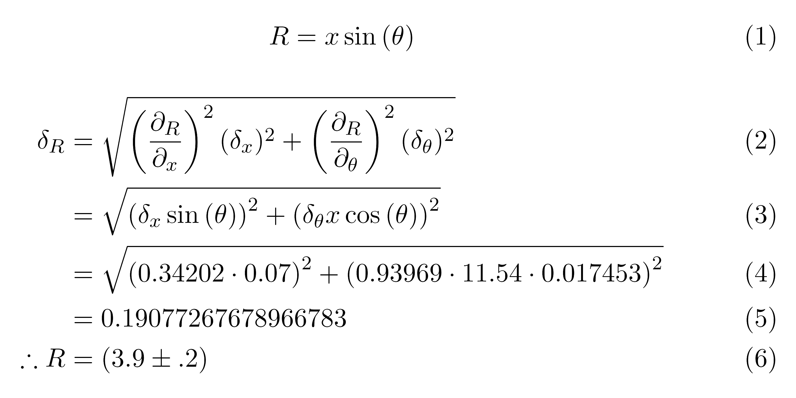

# Overview
Calculates the uncertainty or error propagation for a given equation using SymPy and the method of quadrature (partial derivatives).
Generates LaTeX code for a naive step-by-step calculation of the propagated uncertainty. 

Aug 2021

Todo:
- Might contain bugs as of now so best used for checking work or generating LaTeX
- For addition and multiplication, the partial derivative is taken instead of using simplified formulas (to be improved later)
- Measured values of 0 do not work, do not enter coefficients with 0 uncertainty as variables 
- As of now the argparser is pretty basic:
    - Equation must be wrapped in double quotes, multiplication must be '*'
    - Variables must be wrapped in double quotes with no spaces and separated by commas
    - Values must be a list of lists with no spaces and separated by commas

# Usage
Argparse:

    python expr_to_latex.py --eq="w*x+y^2" --vars="w,x,y" --values=[[4.52,0.02],[2,0.2],[3,0.6]] --result=alpha

Or edit main function:

    z, delta_z = propagate_error('2*x*2*y*z + y**3/z', 'x, y, z', [[10.3, 0.1], [55.6, 0.3], [28.9, 0.2]])
    print(str(z) + ' \u00B1 ' + str(delta_z))

# Example
    $ python expr_to_latex.py --eq="x*sin(theta)" --vars="x,theta" --values=[[11.54,0.07],[20,1]] --degrees=1 --result=R
    
    \begin{equation}
    R = x \sin{\left(\theta \right)}
    \end{equation}
    \begin{align}
    \delta_{R} &= \sqrt{\left(\frac{\partial_{R}}{\partial_{x}}\right)^2 (\delta_{x})^2 + \left(\frac{\partial_{R}}{\partial_{theta}}\right)^2 (\delta_{theta})^2 } \\
    &= \sqrt{\left(\delta_{x} \sin{\left(\theta \right)}\right)^{2} + \left(\delta_{\theta} x \cos{\left(\theta \right)}\right)^{2}} \\
    &= \sqrt{\left(0.342020143325669 \cdot 0.07\right)^{2} + \left(0.939692620785908 \cdot 11.54 \cdot 0.0174532925199433\right)^{2}} \\
    &= 0.19077267678966783 \\
    \therefore R &= (3.9\pm.2)
    \end{align}
    
Adjust LaTeX code to preferred presentation format and enjoy!

